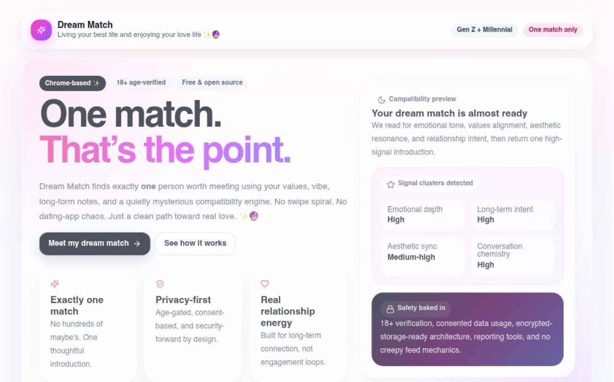

# ✨🔮 Dream Match

**Living your best life and enjoying your love life.**

Dream Match is a stylish experimental dating experience that returns **exactly one match**.

No swipe feeds.  
No hundreds of profiles.  
No dating‑app chaos.  

Just **one thoughtfully selected introduction**.

---

## 🌐 Try the live app

👉 https://dream-match-vibe-coded-app.vercel.app/

---

## 📸 Screenshot



*(Landing page showing the “One match. That’s the point.” concept UI)*

---

## 💡 Concept

Modern dating apps optimize for:

- engagement  
- swiping  
- endless options  
- time spent in‑app  

Dream Match flips the model.

**You don’t need hundreds of matches.  
You need one great one.**

The app collects signals from:

- values  
- vibe  
- personal notes  
- relationship goals  
- optional online presence  

Then returns **one high‑signal match**.

---

## ✨ Core product principles

• **Exactly one match**  
• **Identity‑first compatibility**  
• **No swipe feeds**  
• **Privacy‑forward design**  
• **Emotionally intentional UX**

---

## 🧠 How the prototype works

The current prototype includes:

- landing page
- trust + consent screen
- onboarding flow
- “algorithm cooking” animation
- dream match reveal
- stylish UI

The matching logic currently uses **demo logic**, but the UX models a future compatibility engine based on deeper signals.

---

## ⚙️ Tech stack

Built with:

- **Next.js**
- **React**
- **Framer Motion**
- **Lucide Icons**
- **Vercel**

---

## 🚀 Running locally

Clone the repo:

```bash
git clone https://github.com/YOURNAME/dream-match.git
cd dream-match
```

Install dependencies:

```bash
npm install
```

Run the dev server:

```bash
npm run dev
```

Open:

```
http://localhost:3000
```

---

## 🌍 Deployment

Hosted on **Vercel**

https://dream-match-vibe-coded-app.vercel.app/

Deploy your own version with:

```bash
vercel
```

---

## 🔮 Future ideas

Possible next iterations:

• real compatibility algorithm  
• embeddings‑based matching  
• Supabase profiles + match storage  
• verified identity layer  
• calendar/date coordination  
• explainable match insights  

---

## 🌸 Philosophy

Dream Match is built on a simple idea:

> **You don’t need endless options.  
> You need one beautiful yes.**

---

## ❤️ Status

Experimental prototype.  

Built for fun, exploration, and the vibe.
